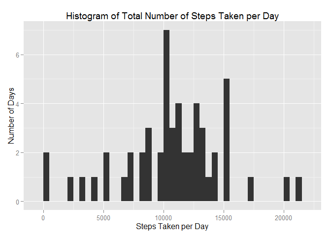
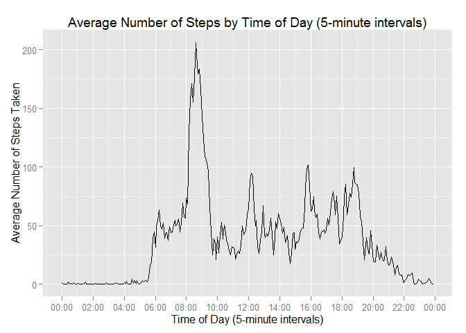
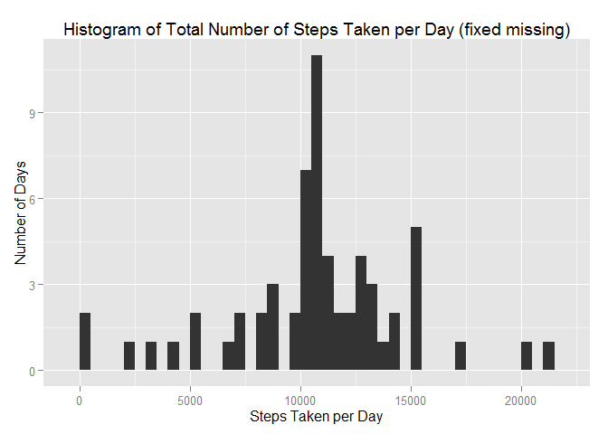
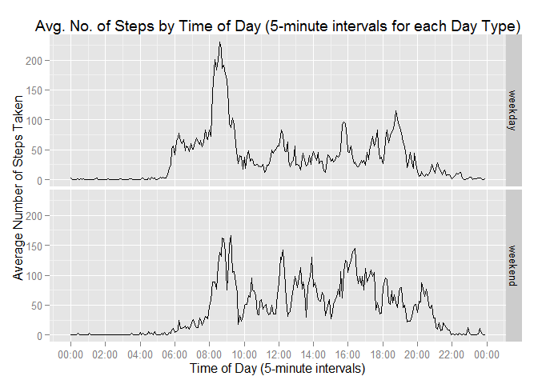

# Reproducible Research: Peer Assessment 1
The following is a fork of [Reproducible Research: Peer Assessment 1](https://github.com/rdpeng/RepData_PeerAssessment1). 
The purposes of this assignment is to show code and plots that answer questions
for this assignment. Where necessary, additional explanatory notes will be provided 
which describes what code is doing. 

## Loading and preprocessing the data
**This section shows code that was used to process data for analysis and provides
an output of str(activity) to show the structure of final output data.**  

1. Extract and load the CSV file into a dataframe data. Data is cached if extract
and dataframe exist.

```r
zipFile <- "activity.zip"
csvFile <- "activity.csv"

if(!file.exists(csvFile)) {
        unzip(zipFile)
}

if(!(exists("activity") && is.data.frame(get("activity")))) {
        activity <- read.csv(csvFile)
}
```
   
2. Make a new datetime column and transform types date to date and interval to factor.

```r
activity$dateChar <- as.character(activity$date)
activity$intervalChar <- paste("0000",as.character(activity$interval),sep="")
activity$intervalChar <- substr(activity$intervalChar
                               , nchar(activity$intervalChar)-4+1
                               , nchar(activity$intervalChar))
activity$intervalChar <- paste(substring(activity$intervalChar, 1, 2),
                               substring(activity$intervalChar, 3, 4),
                               sep=":")
activity$datetimeChar <- paste(activity$dateChar,activity$intervalChar)
activity$time <- strptime(activity$intervalChar, format = "%H:%M")
activity$time <- as.POSIXct(activity$time)
activity$datetime <- strptime(activity$datetimeChar, format = "%Y-%m-%d %H:%M")
activity$date <- as.Date(activity$date)
activity$interval <- as.factor(activity$interval)
activity <- subset(activity, select = c("date", "time", "datetime", "steps"))

str(activity)
```

```
## 'data.frame':	17568 obs. of  4 variables:
##  $ date    : Date, format: "2012-10-01" "2012-10-01" ...
##  $ time    : POSIXct, format: "2015-04-19 00:00:00" "2015-04-19 00:05:00" ...
##  $ datetime: POSIXlt, format: "2012-10-01 00:00:00" "2012-10-01 00:05:00" ...
##  $ steps   : int  NA NA NA NA NA NA NA NA NA NA ...
```

## What is mean total number of steps taken per day?
**In this section, missing data is ignored and mean steps per day is determined
using histograms, mean and median calculations.**  

1. Calculate the total number of steps taken per day using tapply removing missing
value. Store results into new data frame.

```r
activity.daily <- aggregate(steps ~ date, data=activity, FUN = sum, na.rm = TRUE)
activity.daily
```

```
##          date steps
## 1  2012-10-02   126
## 2  2012-10-03 11352
## 3  2012-10-04 12116
## 4  2012-10-05 13294
## 5  2012-10-06 15420
## 6  2012-10-07 11015
## 7  2012-10-09 12811
## 8  2012-10-10  9900
## 9  2012-10-11 10304
## 10 2012-10-12 17382
## 11 2012-10-13 12426
## 12 2012-10-14 15098
## 13 2012-10-15 10139
## 14 2012-10-16 15084
## 15 2012-10-17 13452
## 16 2012-10-18 10056
## 17 2012-10-19 11829
## 18 2012-10-20 10395
## 19 2012-10-21  8821
## 20 2012-10-22 13460
## 21 2012-10-23  8918
## 22 2012-10-24  8355
## 23 2012-10-25  2492
## 24 2012-10-26  6778
## 25 2012-10-27 10119
## 26 2012-10-28 11458
## 27 2012-10-29  5018
## 28 2012-10-30  9819
## 29 2012-10-31 15414
## 30 2012-11-02 10600
## 31 2012-11-03 10571
## 32 2012-11-05 10439
## 33 2012-11-06  8334
## 34 2012-11-07 12883
## 35 2012-11-08  3219
## 36 2012-11-11 12608
## 37 2012-11-12 10765
## 38 2012-11-13  7336
## 39 2012-11-15    41
## 40 2012-11-16  5441
## 41 2012-11-17 14339
## 42 2012-11-18 15110
## 43 2012-11-19  8841
## 44 2012-11-20  4472
## 45 2012-11-21 12787
## 46 2012-11-22 20427
## 47 2012-11-23 21194
## 48 2012-11-24 14478
## 49 2012-11-25 11834
## 50 2012-11-26 11162
## 51 2012-11-27 13646
## 52 2012-11-28 10183
## 53 2012-11-29  7047
```
   
2. Using ggplot, make a histogram of the new data frame.

```r
if("ggplot2" %in% rownames(installed.packages()) == FALSE) 
        {install.packages("ggplot2")}
library("ggplot2")
qplot(activity.daily$steps
      , main = "Histogram of Total Number of Steps Taken per Day"
      , xlab = "Steps Taken per Day", ylab = "Number of Days"
      , binwidth = 500)
```

 
   
3. Calculating and showing mean and median number of steps per day.

```r
mean(activity.daily$steps)
```

```
## [1] 10766.19
```

```r
median(activity.daily$steps)
```

```
## [1] 10765
```
## What is the average daily activity pattern?
**This section shows code to plot time series data at a smaller timescale to
analyze any intraday patterns.**  

1. Make a time series plot of 5-minute intervals (x-axis) and the average number
of steps taken, averaged across all days (y-axis).

```r
library(scales)
activity.hourly <- aggregate(steps ~ time, data=activity, FUN = mean
                             , na.rm = TRUE)
ggplot(activity.hourly, aes(time, steps)) + geom_line() + 
        scale_x_datetime( breaks=("2 hour"), labels = date_format("%H:%M"),
                          name = "Time of Day (5-minute intervals)") +
        scale_y_continuous( name = "Average Number of Steps Taken") +
        ggtitle( "Average Number of Steps by Time of Day (5-minute intervals)" )
```

 
   
2. The following 5-minute interval, on average accross all days in the dataset,
contains the maximum number of steps.

```r
activity.hourly[order(-activity.hourly$steps),][1,1]
```

```
## [1] "2015-04-19 08:35:00 EDT"
```

## Imputing missing values
**This section deals with missing values. The presence of missing days may introduce 
bias into some calculations or summaries of the data.**  

1. Calculate and report the total number of missing values in the dataset (i.e. the total number of rows with NAs).  

```r
sum(is.na(activity$steps))
```

```
## [1] 2304
```
   
2. Use means for 5-minute intervals calculated in activity.hourly, create a fixed
data frame that has all intervals populated.  

```r
activity.fixed <- merge(activity, activity.hourly, by = c("time")
                             , suffixes = c("",".avg"))
activity.fixed$steps.fixed <- activity.fixed$steps
activity.fixed[is.na(activity.fixed$steps),]$steps.fixed <- 
        activity.fixed[is.na(activity.fixed$steps),]$steps.avg
activity.fixed$steps <- activity.fixed$steps.fixed
activity.fixed <- activity.fixed[,1:4]
head(activity.fixed, 20)
```

```
##          time       date   datetime     steps
## 1  2015-04-19 2012-10-01 2012-10-01  1.716981
## 2  2015-04-19 2012-11-23 2012-11-23  0.000000
## 3  2015-04-19 2012-10-28 2012-10-28  0.000000
## 4  2015-04-19 2012-11-06 2012-11-06  0.000000
## 5  2015-04-19 2012-11-24 2012-11-24  0.000000
## 6  2015-04-19 2012-11-15 2012-11-15  0.000000
## 7  2015-04-19 2012-10-20 2012-10-20  0.000000
## 8  2015-04-19 2012-11-16 2012-11-16  0.000000
## 9  2015-04-19 2012-11-07 2012-11-07  0.000000
## 10 2015-04-19 2012-11-25 2012-11-25  0.000000
## 11 2015-04-19 2012-11-04 2012-11-04  1.716981
## 12 2015-04-19 2012-11-08 2012-11-08  0.000000
## 13 2015-04-19 2012-10-12 2012-10-12  0.000000
## 14 2015-04-19 2012-10-30 2012-10-30  0.000000
## 15 2015-04-19 2012-11-26 2012-11-26  0.000000
## 16 2015-04-19 2012-10-04 2012-10-04 47.000000
## 17 2015-04-19 2012-11-27 2012-11-27  0.000000
## 18 2015-04-19 2012-10-31 2012-10-31  0.000000
## 19 2015-04-19 2012-11-18 2012-11-18  0.000000
## 20 2015-04-19 2012-10-05 2012-10-05  0.000000
```
   
3. Create a new dataset that is equal to the original dataset but with the missing 
data filled in. Show the first 10 rows and last 10 rows.

```r
activity.fixed <- activity.fixed[,1:4]
activity.fixed <- activity.fixed[order(activity.fixed$datetime),]
head(activity.fixed, 10)
```

```
##                    time       date            datetime     steps
## 1   2015-04-19 00:00:00 2012-10-01 2012-10-01 00:00:00 1.7169811
## 63  2015-04-19 00:05:00 2012-10-01 2012-10-01 00:05:00 0.3396226
## 128 2015-04-19 00:10:00 2012-10-01 2012-10-01 00:10:00 0.1320755
## 205 2015-04-19 00:15:00 2012-10-01 2012-10-01 00:15:00 0.1509434
## 264 2015-04-19 00:20:00 2012-10-01 2012-10-01 00:20:00 0.0754717
## 327 2015-04-19 00:25:00 2012-10-01 2012-10-01 00:25:00 2.0943396
## 376 2015-04-19 00:30:00 2012-10-01 2012-10-01 00:30:00 0.5283019
## 481 2015-04-19 00:35:00 2012-10-01 2012-10-01 00:35:00 0.8679245
## 495 2015-04-19 00:40:00 2012-10-01 2012-10-01 00:40:00 0.0000000
## 552 2015-04-19 00:45:00 2012-10-01 2012-10-01 00:45:00 1.4716981
```

```r
tail(activity.fixed, 10)
```

```
##                      time       date            datetime     steps
## 17017 2015-04-19 23:10:00 2012-11-30 2012-11-30 23:10:00 0.0000000
## 17074 2015-04-19 23:15:00 2012-11-30 2012-11-30 23:15:00 0.8301887
## 17088 2015-04-19 23:20:00 2012-11-30 2012-11-30 23:20:00 0.9622642
## 17193 2015-04-19 23:25:00 2012-11-30 2012-11-30 23:25:00 1.5849057
## 17242 2015-04-19 23:30:00 2012-11-30 2012-11-30 23:30:00 2.6037736
## 17305 2015-04-19 23:35:00 2012-11-30 2012-11-30 23:35:00 4.6981132
## 17364 2015-04-19 23:40:00 2012-11-30 2012-11-30 23:40:00 3.3018868
## 17441 2015-04-19 23:45:00 2012-11-30 2012-11-30 23:45:00 0.6415094
## 17506 2015-04-19 23:50:00 2012-11-30 2012-11-30 23:50:00 0.2264151
## 17568 2015-04-19 23:55:00 2012-11-30 2012-11-30 23:55:00 1.0754717
```
   
4. Make a histogram of the total number of steps taken each day and Calculate and 
report the mean and median total number of steps taken per day.    

```r
activity.daily.fixed <- aggregate(steps ~ date, data=activity.fixed, FUN = sum
                                  , na.rm = TRUE)
qplot(activity.daily.fixed$steps
      , main = "Histogram of Total Number of Steps Taken per Day (fixed missing)"
      , xlab = "Steps Taken per Day", ylab = "Number of Days"
      , binwidth = 500)
```

 

```r
mean(activity.daily.fixed$steps)
```

```
## [1] 10766.19
```

```r
median(activity.daily.fixed$steps)
```

```
## [1] 10766.19
```
   
Do these values differ from the estimates from the first part of the assignment?   
*Yes*   
What is the impact of imputing missing data on the estimates of the total daily
number of steps?   
*It increases the number of days per histogram bin, but the overall
relative distribution of data across bins looks similar thus little bias was
introduced due to missing data for steps taken. The mean is the same, whereas the
median is different due to inclusion of averages that have decimal values*  


## Are there differences in activity patterns between weekdays and weekends?   
**This section deals with determining differences between weekend and weekdays.**  

1. Use the fixed activity dataset, add a factor variable that splits weekdays from
weekends. A daytype factor variable will be shown in the structure.

```r
activity.fixed$weekday <- weekdays(activity.fixed$date, abbreviate = TRUE)
activity.fixed$daytype <- as.factor(ifelse(
        substring(activity.fixed$weekday,1,1) == "S", "weekend", "weekday"))
str(activity.fixed)
```

```
## 'data.frame':	17568 obs. of  6 variables:
##  $ time    : POSIXct, format: "2015-04-19 00:00:00" "2015-04-19 00:05:00" ...
##  $ date    : Date, format: "2012-10-01" "2012-10-01" ...
##  $ datetime: POSIXlt, format: "2012-10-01 00:00:00" "2012-10-01 00:05:00" ...
##  $ steps   : num  1.717 0.3396 0.1321 0.1509 0.0755 ...
##  $ weekday : chr  "Mon" "Mon" "Mon" "Mon" ...
##  $ daytype : Factor w/ 2 levels "weekday","weekend": 1 1 1 1 1 1 1 1 1 1 ...
```
   
2. Below is a panel plot containing a time series plot (i.e. type = "l") of the
5-minute interval (x-axis) and the average number of steps taken (from fixed data)
, averaged across all weekday days or weekend days (y-axis).   

```r
activity.hourly.daytype <- aggregate(steps ~ time + daytype, data=activity.fixed
                                     , FUN = mean, na.rm = TRUE)
ggplot(activity.hourly.daytype, aes(time, steps)) + geom_line() +
        scale_x_datetime( breaks=("2 hour"), labels = date_format("%H:%M")
                          , name = "Time of Day (5-minute intervals)") + 
        scale_y_continuous( name = "Average Number of Steps Taken") +
        ggtitle( paste("Avg. No. of Steps by Time of Day (5-minute intervals", 
                       "for each Day Type)") ) +
        facet_grid(daytype ~ .)
```

 
